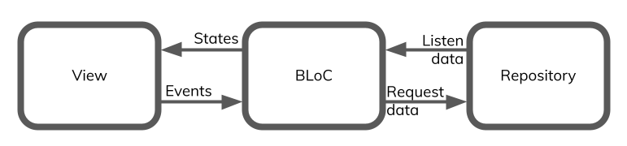

# Combine Bloc
> An implementation of the ´BLoC´ Design Pattern (Business Logic Component) with Apple's Combine framework.

[![Swift Version][swift-image]][swift-url]
[![License][license-image]][license-url]

BLoC design pattern was initially conceived to help separate presentation from business logic and thus, also increase code reuse as Blocs should be platform agnostic. 
The key points are:
* Inputs and outputs are implemented with event-processing operators
* Dependencies must be injectable and platform agnostic
This package implements a Bloc as a custom Combine Subject that receives ´Events´ as inputs and outputs ´States´. 



## Installation

Add this project on your `Package.swift`

```swift
import PackageDescription

let package = Package(
    dependencies: [
        .Package(url: "https://github.com/wjuniorgit/combine-bloc", from: "0.1.0"),
    ],
)
```

## Meta

Wellington Soares

Distributed under the BSD license. See ``LICENSE`` for more information.

[https://github.com/yourname/github-link](https://github.com/dbader/)

[swift-image]:https://img.shields.io/badge/swift-5.2-orange.svg
[swift-url]: https://swift.org/
[license-image]: https://img.shields.io/badge/License-BSD-blue.svg
[license-url]: LICENSE
